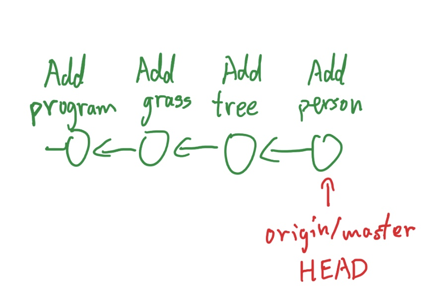
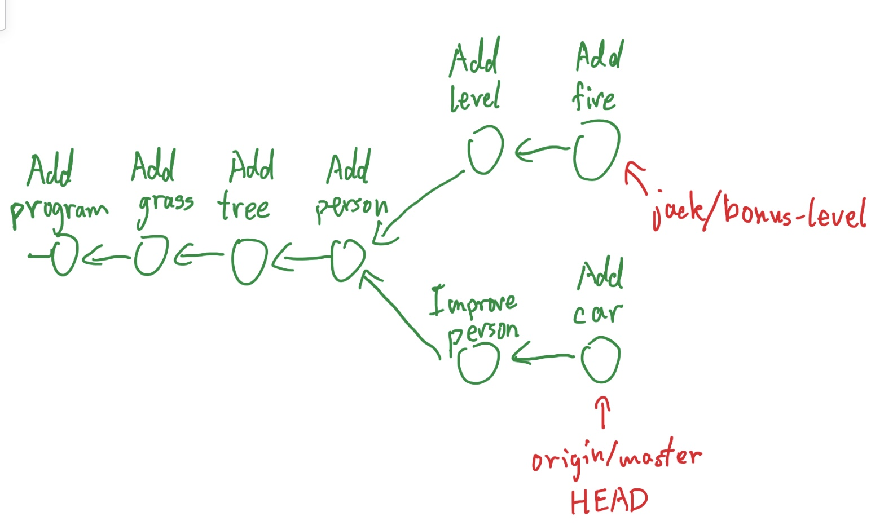
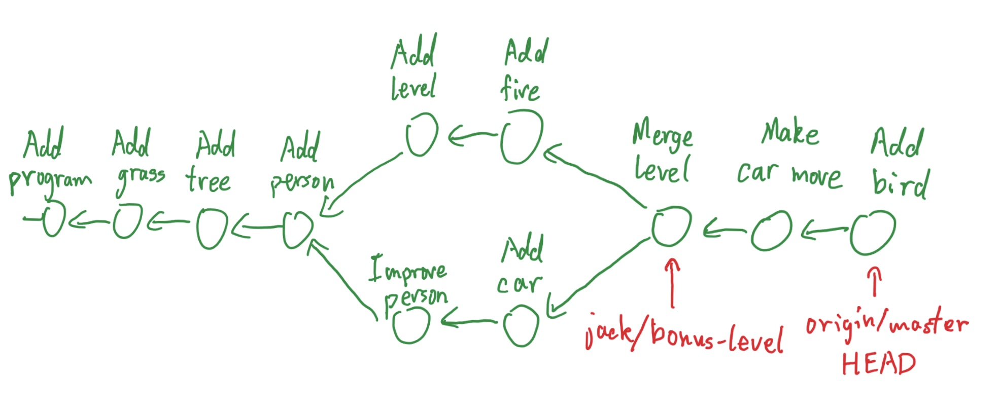
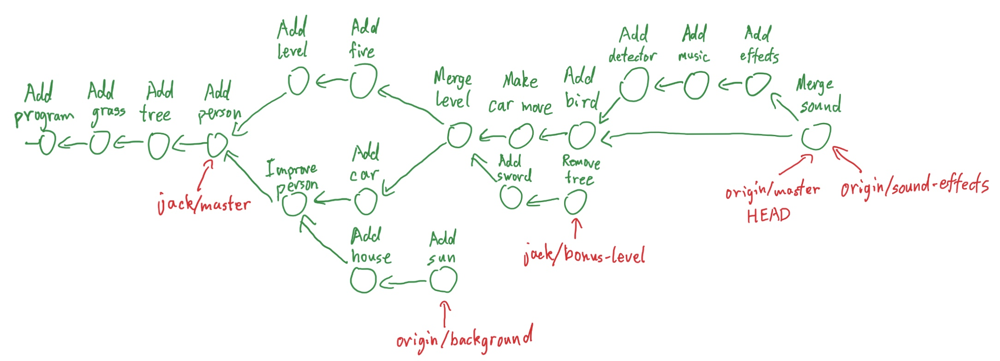

## Introduction

If you're this far, you probably know Git. But, are you _good_ at it? Chances are, the answer is no.

Even if you can already use Git, there are two reasons you should read this following guide.

- Maintaining proper Git hygiene makes your life and your collaborators' lives much easier.
- Making clever use of all the Git commands at your disposal can increase efficiency and reduce error greatly.

As a side note, if you're a fan of GUIs, you might want to consider downloading a GUI for interacting with Git. One great choice is [Sourcetree](https://www.sourcetreeapp.com). If you use Sourcetree, all your changes and Git history can be easily visualized, and the commands will be more accessible without memorizing all the commands and their flags in the terminal. However, this GUI is _not_ more powerful than Git. The terminal version of Git is even more powerful; you just need to do some digging to discover all the functionalities. So if you're a fan of hacker-style maximum efficiency, you can stick to the terminal for now.

On another note, you should skim this resource. The more experienced CompServ officers and alumni can advise you what commands to use as well as long you ask.

## Other Resources
* Git guide by CS 61B Fall 2021: https://inst.eecs.berkeley.edu/~cs61b/fa21/docs/using-git.html
    * Look at Sections A, B, C, and F
* Interactive Git Guide: https://learngitbranching.js.org/
    * "Main":
        * Recommended Sections (in order of priority): "Introduction Sequence", "Ramping Up", Level 2 of "Moving Work Around", Level 1 and 2 of "A Mixed Bag"
        * Good to know: All sections of "Moving Work Around" and "A Mixed Bag"
        * Great to Know: Level 1 of "Advanced Topics"
        * Overkill: "Advanced Topics" (Level 2 and 3)
    * "Remote":
        * Recommended Sections: "Push & Pull -- Git Remotes!" (Level 1 - 3, 5 - 6, skip others)
        * Good to Know: "To Origin and Beyond -- Advanced Git Remotes"
    * If there is a command not used in this written guide, but used in the Interactive Git Guide, it may be more complicated / weird than necessary -- consult with experienced officers
* Sandbox Interactive Visualization: https://git-school.github.io/visualizing-git/

## Proper Git Hygiene

As a foreword, these are just general guidelines. There will often be scenarios when it makes more sense to violate some of these guidelines, or it will simply take too much time to correct a violation. For example, if you implement A, then implement B, then realize you forgot to do something for A, it may be too big a hassle to rebase your history to put the second part of A before B. Then it's fine to just put that last bit in a commit after B.

### General procedure

Do not work directly on the main repo! Fork the repo and do all work on your fork. If multiple people are working on a large project, it is okay to put that work in a branch of the main repo. Otherwise, keep your fork's master branch in sync with `compserv/master`, and do all of your work in your fork's other branches. For example, you might implement an rsvp bug fix in `origin/rsvp-bug` on your local fork. Create a separate branch for each independent project. This might seem unnecessary, but it keeps things much cleaner. If you ask "Why?" I ask, "Why not?" It's not like good hygiene is a big hassle.

Rebase / Merge from `compserv/master` often, at the very least before you make a pull request. Fix all merge conflicts and migration conflicts before merging. Also, **NEVER force push** to the main repo, though it's okay to force push to your own fork occasionally.

### Committing

Do not, do NOT implement all your changes at once and push them in a giant commit. Not only is it easy to lose your work this way, it's also harder to tell what is going on. Someone might later want to reverse one of these changes, and it is much easier to do so if all those changes are in one or a few commits. To select which changes to put in a commit, you can make flexible use of `add`: `git add .`, `git add directory/`, `git add *.html`, `git add --patch`.

Also, it is good to review your changes before committing, and test your code before creating a pull request. You can use `git status` and `git diff` to review your changes (or Sourcetree). This makes sure you don't accidentally commit, for example, debugging statements. Also make sure you don't commit any local configuration files like `.DS_Store` or `.vscode` (put them in the `.gitignore` file).

### Commit Messages

Commit messages should be descriptive but brief. If there is a lot going on, you can have a title followed by a paragraph containing details, separated by a blank line. The message should be capitalized and begin with a present-tense verb, such as `"Fix bug in candidate that RSVPs can't be deleted"`. You might think these are arbitrary unnecessary rules. To which I again say, "Why not?" If there's no reason to not follow these rules, just do it. The commit history will look a lot cleaner.

## What is Git history?

First you must understand how Git works. It doesn't just save your changes. It saves the entire history tree. Technically it's a history directed acyclic graph. So how does it work?

First, let's say you're working on a game. Your commit history would look like this:



But then, Jack starts working with you. Jack is implementing a separate feature at the same time as you make new commits for your own project. Jack is on a separate branch. So the commit history diverges:



Eventually, you two must merge your branches. Then, you make even more changes:



This is how git history works. Eventually history trees can get very complicated:



Okay, now that you have a good idea of how this works, we need to explain branches. Now this may come as a surprise, but _branches are not branches_. In Git, "branches" are pointers to a location in the Git history. So in the above diagram, `origin/master`, `origin/background`, `origin/sound-effects`, `jack/master`, and `jack/bonus-level` are all distinct branches.

What is `HEAD`? This is where you are right now. All the files you see in your repo, their state are the state of files in the commit that `HEAD` points to.

This is all very abstract, so make sure to check out [this interactive visualization](https://git-school.github.io/visualizing-git/). When reading about the following commands, enter them into the visualization to see what happens.

## Common Git Commands

These are some commands that you should know know and are used for the majority of the time in CompServ and in life. Of course, there are still tons of other git commands not listed in this document, but hopefully this is enough for you to go off of now.

- `add`
- `rm [-r]`
- `commit [-m]`
- `status`
- `fetch`, `merge`, `rebase`, `pull`, `push [--force]` or `push -f`
- `branch`
- `checkout`
- `checkout -b`
- Use of wildcards, such as `.`, `..`, `*`, `-A`

## Useful and Niche Git Commands

These "advanced commands" aren't actually difficult to use at all, but are rarely used (hence "niche"). Most people just don't bother to learn about them. It is true that all those commands take a while to memorize, but it's totally worth it. Or you could just use Sourcetree.

Now, I'm not gonna explain all of these commands in detail. You should google each one. We live in the Internet age. I believe in you.

### reset

`git reset` is one of the more complicated commands, but it's so useful that I have to talk about it. There are two types of `reset`, and they are _completely_ different, which is why it's so confusing. _Commit-level_ `reset` moves your `HEAD` to another commit. If you are on a branch, it moves the branch to point to the new commit as well.

How do you specify a commit? Well, all commits have IDs. You can discover the ID by using `git log`. You don't have to type the entire ID as it is super long; you can use any prefix of it as long as that prefix is unique. You can also use branch names or `HEAD` as the location you want to switch to, You can also use the special symbol `~`. For example:

```
git reset --hard c3f # go to the commit that has ID beggining with c3f
git reset --hard compserv/master # go to the commit that the branch master on the compserv fork points to
git reset --hard HEAD~3 # go back three commits
```

Also, you generally want to use the `--hard` flag, otherwise your files will change to the commit you want to jump to, but your staging area still contains the old changes. That's commit-level `reset`.

There's also file-level `reset`. If you put a file after `git reset`, or add a `--`, the `reset` becomes file-level. It changes what's in the staging area, so it should really be called `unstage`. You can still specify a commit; if you do so, it will change what's in the staging area to that commit, but only for the file you specify. Some examples:

```
git reset . # unstages everything in this directory
git reset -- . # same as last one
git reset HEAD~1 -- . # sets staging area to what it looked like one commit ago
git reset HEAD file.txt # unstages file.txt
git reset master file.txt # changes the staging area's file.txt to look like what file.txt looks like on branch master
```

### checkout

`checkout` is `reset`'s twin. Commit-level `checkout` also moves you to another commit. The difference is that if you're on a branch, your `HEAD` moves, but your branch stays put. This is why you can use `checkout` to switch between branches without affecting those branches. If you switch to an arbitrary commit, you are now no longer on any branch. This is called a "detached HEAD."

File-level `checkout` is again completely different from commit-level `checkout`. Instead of changing the staging area like file-level `reset`, it changes the files directly, but keeps them unstaged.

```
git checkout . # throw away all unstaged changes
git checkout -- . # same as last one
git checkout master file.txt # changes the contents of file.txt to what it looks like on branch master
```

### show

`git show` displays information about a certain commit, including its commit message, author, time, and line changes (e.g. `git show c3f`, `git show HEAD~1`, `git show compserv/master`).

### diff

`git diff` displays what changes you've made but not staged yet. `git diff HEAD` shows what changes you've staged. `git diff a b` shows the difference between `a` and `b` where `a` and `b` are commits (e.g. `c3f`, `HEAD~1`, `compserv/master`).

### revert

`git revert a` reverts the commit `a`. It creates a separate commit to do so, so it's nice if you want to keep track of what you've reverted in the history. It can only revert the entire commit though, not individual files.

### alias

This is a really nice command. You can create aliases for commands you use often. For example I use `st` to mean `status` and `br` to mean `checkout -b`. Check Google for exact usage and suggested aliases.

### log

You might already know `git log`, which shows you your branch history. But did you know it can take in two flags, `--graph` and `--oneline`? I like these flags so much I've created an alias for them, so that `lg` expands to `log --graph --oneline`.

### stash

`git stash` puts your changes away in a secure place so you can get them back later with `git stash pop` (run `git stash -h` to see all the commands). It's useful if you have unsaved changes that you don't want to commit right now, but an operation requires you to remove all unsaved changes (e.g. `checkout` or `rebase -i`).

### rebase

An alternative to `merge`. When you do `git pull origin master`, it's really doing `git fetch origin master; git merge origin/master`. `fetch` finds the `origin` information on the Internet and `merge` creates a new commit that reconciles you with whatever branch you're pulling from. This creates a branch in your history that is later merged. But sometimes you would prefer a linear history, to make it as if the remote stuff happened first, instead of concurrently with your changes. That's what rebase does. Go to [the visualization](https://git-school.github.io/visualizing-git/) now and observe the difference between `merge` and `rebase`.

### commit --amend

This allows you to modify the last commit. You can change the commit message, or add other changes that in hindsight would've been better in the last commit instead of being in its own commit. Note that if you've already pushed, you now need to force push.

### rebase -i

Interactive `rebase` is quite different from normal `rebase`. It allows you to amend commits that are not the last commit. You can change any commit messages, the commit contents, or the order of the commits. You can delete, merge, or separate commits. It's quite powerful. Google for details.

### add -i

Interactive `add` is an interface to add only certain changes. You can for example only add a portion of a file.

### blame

`git blame` finds out who edited a certain line.

### cherry-pick

This command can select any arbitrary commit add shove it into your own branch.

### clean

`git reset --hard` only resets tracked changes. To get rid of untracked (but not ignored) files, run `git clean`. The flag `-f` must be used to make sure you don't delete things by accident. It's good practice to do a dry run first with `-n`.

## Rebase vs Merge

As mentioned before, rebasing allows you to stay in sync with other branches by applying all the commits starting from the most common commit (called a "split point") and then applying your commits from that split point along your current branch on top of the commits from the other branch.


However, since we aren't a full-fledged software company, sometimes it's just easier to Merge, especially if there are changes made over time as well since the start of your project / feature. Just try either and revert worst case scenario.

However, rebase just creates a cleaner git history.

The only restriction is that YOU ONLY DO IT ON **YOUR OWN FORK.**

## Working with Forks

Credit to [Justin James](https://digitaldrummerj.me/git-syncing-fork-with-original-repo/)

> Syncing your forked repository to the original repository is an important step before submitting any pull request to the original repository for the changes in your forked repository. Even if you are not going to submit a pull request to the original repository, there are times that you want the additional features and/or bug fixes that have been done since you forked the original repository.

> You could do a pull request but this adds an additional commit into your forked repository instead of making your forked repository match the original repository. In order to sync the forked repository without adding any additional commits as part of the process you need to configure the original repository as an upstream remote, merge in the changes from the original repository and then push the merged version back to Github.

### Viewing your currently configured remote repositories
`git remote -v`

### Adding a remote repository as an upstream repository
`git remote add upstream https://github.com/[Original Owner Username]/[Original Repository].git`

e.g. `git remote add upstream https://github.com/compserv/hknweb.git` to set Compserv HKNWeb as the upstream

### Merging or Rebasing upstream repo into your fork
1. `git fetch upstream`
2. `git checkout master`
3. `git merge upstream/master` or `git rebase upstream/master`
4. `git push origin master`